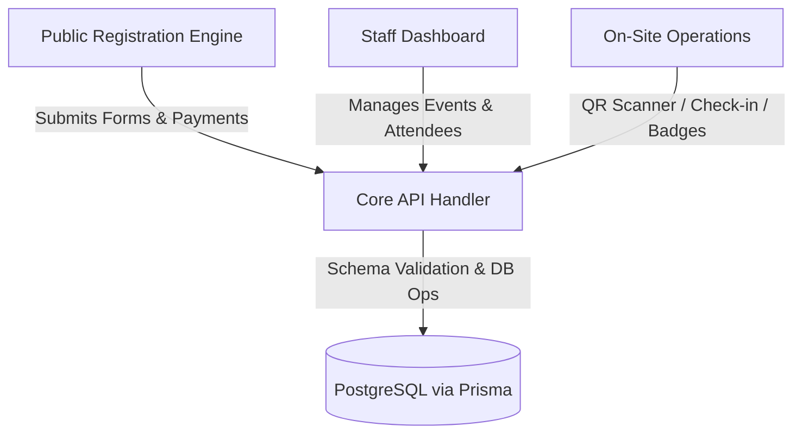
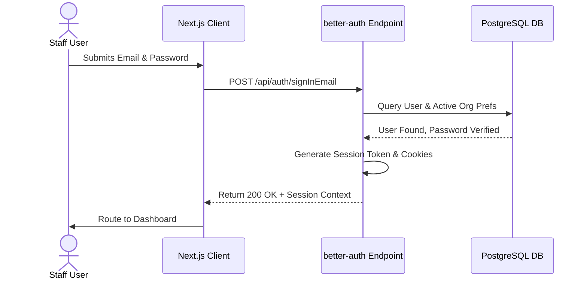

# SOFTWARE REQUIREMENTS SPECIFICATION (SRS)
## GCME Multi-Tenant Event Registration & Operations Platform

---

## Document Information

| Attribute | Details |
| :--- | :--- |
| **Project Name** | cls-event (Branded as GCME Event Operations System) |
| **System Version** | 3.0 (Evolved Multi-Tenant and Dynamic Form Architecture) |
| **Document Version** | 1.0.0 |
| **Prepared By** | Antigravity AI Coding Assistant & Technical Core Team |
| **Approval Status** | Pending Review |
| **Effective Date** | June 5, 2026 |

### Revision History

| Date | Version | Description | Author |
| :--- | :--- | :--- | :--- |
| June 5, 2026 | 1.0.0 | Initial baseline draft detailing multi-tenant and dynamic schemas. | Technical Core |

### Approval Sign-Off

| Name | Role / Title | Signature | Date |
| :--- | :--- | :--- | :--- |
| `[TBD]` | Project Sponsor / Church Leadership Lead | | |
| `[TBD]` | Lead Software Architect | | |
| `[TBD]` | Operations Coordinator | | |

---

## 1. Introduction

### 1.1 Purpose
This Software Requirements Specification (SRS) details the functional, behavior, and non-functional requirements for the **cls-event** system. The platform functions as the core digital interface managing participant onboarding, group registration processing, real-time ticket numbering, on-site arrival validation (check-in), badge creation, and catering/vendor alignment.

This document serves as:
* The development contract for the engineering team.
* The test verification baseline for the Quality Assurance (QA) team.
* The architectural and operational reference for system administrators and deployment leads.

### 1.2 Scope
The `cls-event` system is a single Next.js 16 application backed by a PostgreSQL database and Prisma ORM. The scope covers:



1. **Multi-Tenant Partitioning (`src/lib/tenancy/`):** Isolation of all application layers under organizations (`Organization` model). Database records, settings, staff groups, and operational scopes must be isolated via tenant routing and session context check validation rules.
2. **Dynamic Form & Questionnaire System (`src/lib/forms/`):** Eliminating database-level registration migrations. Forms are built dynamically via `Form` and `FormField` models, with submissions stored in the JSONB-backed `FormResponse` model.
3. **Identity & Granular RBAC (`src/lib/auth.ts`):** Client and server session management handled via `better-auth`. User permissions are evaluated at the active organization tier, offering Org Roles: `OWNER`, `ADMIN`, and `STAFF`.
4. **Payment Gateway Integration (`src/app/api/payment/`):** Automatic status processing and webhook verification utilizing Telebirr APIs and administrative manual billing overrides.
5. **Operational Modules:** 
   * Automated ticket generation based on prefix ranges (`Batch`).
   * On-site QR scanning and check-in registers.
   * On-screen HTML badge layout compilation and print logs.
   * Vendor catering allocation.

### 1.3 Objectives
* **Zero-Downtime Schema Evolution:** Event planners must be capable of establishing new summit entry configurations with custom fields (e.g. text inputs, select lists, radio buttons, file uploads) via the admin panel without manual code updates.
* **On-Site Throughput:** Reduce registration desk processing times down to under **5 seconds** per attendee via barcode scanner checks and on-screen dynamic badge generation.
* **Data Security & Isolation:** Guarantee strict data segregation, ensuring organizers from Organization A cannot view, query, or edit registrations, settings, or statistics belonging to Organization B.
* **Multilingual Localization:** Deliver user interfaces in English (`en`), Amharic (`am`), Oromo (`or`), and Tigrinya (`ti`) to support diverse participant backgrounds.

### 1.4 Intended Audience
* **Frontend & Backend Engineers:** Reference for REST API endpoints, routing patterns (`src/app/`), state selectors, and database queries.
* **QA & Test Engineers:** Blueprint for validation scripts, boundary test scenarios, security threat assessments, and check-in simulators.
* **System Operations (SysOps) / Devops:** Instructions on environmental configuration, Docker deployments, database backups, and indexing needs.

---

## 2. System Overview

### 2.1 Business Background
The Great Commission Ministry Ethiopia (GCME) conducts large-scale, multi-regional Church Leadership Summits bringing together thousands of participants, including church leaders, ministry partners, professionals, students, and event coordinators. Managing registrations, payments, and logistics has historically been bottlenecked by fragmented tools, manual spreadsheets, and inflexible forms. The transitioned `cls-event` system aims to establish a single, robust platform to service multiple GCME regional offices and church networks concurrently.

### 2.2 Problem Statement
The legacy event registry suffered from three major issues:
1. **Rigid Database Models:** The core schema stored participant details in fixed columns (e.g., `churchName`, `serviceRole`). Adding a simple question (e.g., "Do you require lodging?") required manual schema modification, database migration, and codebase rebuilds.
2. **Lack of Tenant Boundaries:** There was no logical separation of data, meaning system administrators from different regional chapters shared the same tables, posing security risks and preventing concurrent independent operations.
3. **Manual Check-In Friction:** High attendee volume caused bottlenecks at check-in tables, and badging was handled using pre-printed cards that could not adapt to last-minute edits.

### 2.3 Proposed Solution
The transitioned architecture moves to a dynamic, multi-tenant model:

```
+-------------------------------------------------------------+
|                      Next.js App Router                     |
+-------------------------------------------------------------+
                              |
                              v
+-------------------------------------------------------------+
|              better-auth (Session Enforcement)              |
+-------------------------------------------------------------+
                              |
                              v
+-------------------------------------------------------------+
|                       Prisma Client                         |
+-------------------------------------------------------------+
         /                    |                    \
        v                     v                     v
+---------------+     +---------------+     +---------------+
| Organization  |     |     Event     |     |     Form      |
|  Isolation    |     |  Association  |     |  Definition   |
+---------------+     +---------------+     +---------------+
        \                     |                     /
         v                    v                    v
+-------------------------------------------------------------+
|                PostgreSQL (JSONB Storage)                   |
+-------------------------------------------------------------+
```

* **Tenant Isolation:** A tenant is represented by the `Organization` table. Every administrative path segment must resolve an `orgSlug`, and the backend enforces queries via the user's active session organization preferences (`UserActiveOrganization`).
* **Dynamic Registrations:** Participant info is stored as JSON data in `FormResponse.responses`. Metadata mapping links these dynamically to operational entities (e.g. check-ins, batches, and vendors).
* **Consolidated Operations Panel:** Real-time dashboards provide unified registration pipelines, prefix batches, vendor capacity monitoring, and localized notification systems.

---

## 3. User Characteristics

### 3.1 Super Administrator (Platform Super Admin)
* **Access Control:** Global system rights via `User.isPlatformSuperAdmin = true`.
* **System View:** Full global permissions across all organizations and events.
* **Primary Responsibilities:**
  * Provisioning new tenant organizations and assigning initial owners.
  * Configuring platform-wide features and security settings.
  * Orchestrating survey feedback campaigns (`PlatformFeedbackCampaign`).
  * Monitoring database scaling and performing data backfills.

### 3.2 System Administrator (Organization Admin / Owner)
* **Access Control:** Scoped strictly to the active organization (`OrgRole.OWNER` or `OrgRole.ADMIN`).
* **System View:** Complete administrative control over organization configurations.
* **Primary Responsibilities:**
  * Setting up events, customize fields (`Form` & `FormField`), and mapping locales.
  * Registering vendors, setting capacities, and creating prefix batches (`Batch`).
  * Managing staff invites and configuring role-based permissions.
  * Accessing financial reports, checking invoice statuses, and triggering exports.

### 3.3 Staff / Operational User
* **Access Control:** Scoped strictly to the active organization (`OrgRole.STAFF`).
* **System View:** Access to operational routes as defined in the organization member's permission list.
* **Primary Responsibilities:**
  * Searching registrations and attendee directories.
  * Validating arrivals (manual check-in or QR scanning).
  * Printing physical badges on-site and monitoring food/vendor ticket assignments.

### 3.4 Guest User (Registrant)
* **Access Control:** Public, unauthenticated interface.
* **System View:** Landing, event selection, and localized registration forms.
* **Primary Responsibilities:**
  * Submitting registrations for individuals or groups.
  * Processing payment credentials and uploading receipts.
  * Retrieving QR confirmation tickets.

---

### Role & Permission Matrix

The platform checks permission strings located in `OrganizationMember.permissions`. The table below outlines the default capabilities for each role configuration:

| Permission Name | Operational Description | Owner | Admin | Staff |
| :--- | :--- | :---: | :---: | :---: |
| `manage_users` | Invite, modify roles, and remove organizational staff. | Yes | Yes | No |
| `manage_roles` | Alter specific custom permission lists for members. | Yes | No | No |
| `view_registrations` | View registrations, search list, and print badges. | Yes | Yes | Yes |
| `manage_payments` | Confirm pending payments and process manual overrides. | Yes | Yes | No |
| `register_participants` | Submit registrations inside the staff dashboard. | Yes | Yes | Yes |
| `check_in_participants` | Perform attendee check-ins (manual/QR). | Yes | Yes | Yes |
| `view_financials` | Review payment summaries, revenue cards, and reports. | Yes | Yes | No |
| `delete_registrations` | Soft-delete participant registration records. | Yes | Yes | No |
| `edit_registrations` | Modify registration details and form fields. | Yes | Yes | No |
| `manage_batches` | Define ticket ranges, prefixes, and categories. | Yes | Yes | No |
| `manage_groups` | Establish user grouping categories. | Yes | Yes | No |
| `manage_vendors` | Configure catering capacities and vendor lists. | Yes | Yes | No |

---

## 4. Functional Requirements

### User Authentication



#### 4.1.1 Registration (Staff)
* **Description:** Access to the platform dashboard for new staff members is restricted to invitation links.
* **Endpoint:** `POST /api/auth/complete-invite`
* **Pre-conditions:** User has received a valid invitation token from an administrator.
* **Inputs:** `token` (String), `password` (String), `name` (String).
* **Validation Rules:**
  * Password must contain at least 8 characters, including one number and one special character.
  * Token must exist in the `OrganizationInvitation` table, must not be expired, and must not have been previously used.
* **Post-conditions:** Creates a new `User` record, inserts an `OrganizationMember` connection with the role and permissions defined in the invitation, and marks the invitation token as used.

#### 4.1.2 Login (Staff & Admins)
* **Description:** Authenticates users and sets up organizational permissions in the active session.
* **Endpoint:** `POST /api/auth/signInEmail`
* **Inputs:** `email` (String), `password` (String).
* **Validation Rules:**
  * Email must conform to standard email regex syntax.
  * Credentials must match stored password hashes.
* **Session Enrichment:** The custom better-auth session plugin loads the user's details, active organization, role, and permission array, storing these in the session cookie.

#### 4.1.3 Password Reset
* **Description:** Allows locked-out users to request password recovery.
* **Endpoints:** 
  * `POST /api/auth/forget-password` (triggers reset link email)
  * `POST /api/auth/reset-password` (updates database record)
* **Inputs:** `email` (String) or `token` (String) + `newPassword` (String).
* **Validation Rules:** The token must be valid and must have been requested within the last hour.

#### 4.1.4 Email Verification
* **Description:** Verifies that a user has access to their registered email address.
* **Endpoint:** `GET /api/auth/verify-email`
* **Process:** Compares the incoming token parameter against the verification database table and updates `User.emailVerified` to `true`.

---

### User Management

#### 4.2.1 Create User (Invite Staff)
* **Description:** Org owners or admins invite new staff members to join the workspace.
* **Endpoint:** `POST /api/admin/invitations`
* **Pre-conditions:** The logged-in user must hold the `manage_users` permission.
* **Inputs:** `email` (String), `role` (`OrgRole` Enum), `permissions` (String Array).
* **Action:** Populates the `OrganizationInvitation` table, generates a secure random token, and sends an email via SMTP containing the invitation link.

#### 4.2.2 Edit User Permissions
* **Description:** Updates the permissions of an existing team member.
* **Endpoint:** `PATCH /api/admin/users/[userId]`
* **Inputs:** `permissions` (String Array), `role` (`OrgRole` Enum).
* **Validation Rules:**
  * Users cannot edit their own permissions.
  * Only users with `manage_roles` can change another user's role configuration.
  * The target user must be a member of the caller's active organization.

#### 4.2.3 Delete User (Remove Member)
* **Description:** Removes a member's access to the organization.
* **Endpoint:** `DELETE /api/admin/users/[userId]`
* **Action:** Deletes the corresponding record from the `OrganizationMember` table. The user's account is preserved, but they can no longer access dashboard routes for this organization.

#### 4.2.4 Assign Roles
* **Description:** Reallocates base roles and permission templates to members.
* **Endpoint:** `PUT /api/admin/roles`
* **Inputs:** `userId` (String), `role` (Enum).

---

### Dashboard Management

#### 4.3.1 Summary Widgets
* **Description:** Displays the primary metrics of the active event.
* **Data Sources:** 
  * Total Registrations (Count of active `EventRegistration` records).
  * Approved Payment Amount (Sum of `amount` where `paymentStatus = "approved"`).
  * Checked-In Attendees (Count of `EventRegistration` where `checkedIn = true`).
  * Vendor capacities.
* **Access Rules:** Financial summary cards are hidden if the active user lacks the `view_financials` permission.

#### 4.3.2 Real-time Visualizations
* **Description:** Provides charts and tables depicting registration trends, check-in activity throughout the day, and group sign-up distributions.
* **Data Refresh:** Built-in React Query polling handles dashboard updates without manual page refreshes.

---

### Reports Management

#### 4.4.1 Participant Search List
* **Description:** Displays registration details, payment statuses, and verification history.
* **Features:** 
  * Paging (defaulting to 50 rows per page).
  * Soft-deleted entry inclusion toggle.
  * Search capability covering fields stored within the dynamic JSONB response structure (e.g., `full_name`, `email`, `phone_number`).

#### 4.4.2 Export Engine
* **Description:** Generates files for analysis in external software.
* **Endpoint:** `GET /api/registrations/export`
* **Functionality:** Fetches participant records, resolves the dynamic `FormResponse` key-value pairs, flattens JSON objects into distinct columns, and writes the output as a downloadable CSV stream.

---

### Notification Management

#### 4.5.1 Transactional Event Emails
* **Description:** Automatically sends email confirmations containing event location details, ticket numbers, and check-in QR codes.
* **Triggers:** Dispatched when a registration payment is marked as "approved".
* **Templates:** Templates are defined per organization and event using the `OrganizationEmailTemplate` model.

#### 4.5.2 Custom Campaign Broadcasting
* **Description:** Allows admins to send announcements or updates to all registered attendees.
* **Features:** 
  * Filter target recipients by batch, registration role, or payment status.
  * Track email metrics in the `OrganizationEmailSent` table to log recipient counts and body text.

---

### Settings Management

#### 4.6.1 Batch Configurations
* **Description:** Groups attendees into categories to manage ticket issuance.
* **Inputs:** `name` (String), `prefix` (Int), `roles` (String Array).
* **Action:** When a registrant selects a specific role during signup, the system assigns a ticket number using the prefix configured for that role's batch (e.g. Students start at ticket number `10000`, Church Leaders at `20000`).

#### 4.6.2 Vendor & Capacity Rules
* **Description:** Configures event vendor options (e.g. food tables, catering lines) to distribute attendee traffic.
* **Inputs:** `name` (String), `capacity` (Int).
* **Logic:** When a participant is checked in, they are assigned a vendor. The system prevents assignments to vendors that have reached their configured capacity limit.

---

## 5. Non-Functional Requirements

### 5.1 Performance
* **Latency Benchmarks:** Read/write actions on dashboards, search results, and vendor status grids must complete in under **250 milliseconds** (assuming average network conditions).
* **Form Schemas:** Generating Zod schemas from database configurations and rendering form fields dynamically must complete in under **100 milliseconds**.
* **High-Throughput Check-In:** The QR check-in API must process check-ins in under **150 milliseconds** to prevent queues at entry points.

### 5.2 Security
* **Data Isolation:** Every API endpoint must perform tenant isolation checks:
  ```typescript
  // Example boundary check pattern
  const member = await prisma.organizationMember.findFirst({
    where: {
      userId: session.user.id,
      organizationId: activeOrgId,
    }
  });
  if (!member) throw new Error("Access Denied: Tenant Boundary Violation");
  ```
* **Password Hashing:** Client credentials must be hashed using robust encryption standards (e.g., bcrypt or Argon2) via `better-auth`. Cleartext passwords must never be logged or stored.
* **Input Sanitization:** All text inputs must be sanitized to prevent Cross-Site Scripting (XSS) and SQL injection vulnerabilities, especially within dynamic JSON form values.

### 5.3 Reliability
* **Transaction Safety:** Multi-table writes (e.g., creating a `FormResponse`, writing an `EventRegistration`, and decrementing a batch inventory counter) must execute within a database transaction block (`prisma.$transaction`) to prevent orphaned records.
* **Soft Deletions:** Deleting attendee records must set a `deletedAt` timestamp instead of deleting the database row. This allows administrators to restore accidentally deleted registrations.
* **Fail-Safe Webhooks:** The payment callback system must log incoming payloads, verify transaction references, and support manual reprocessing in case of network drops.

### 5.4 Availability
* **Target Uptime:** Ensure 99.9% application uptime during active registration and event windows.
* **Redundancy & Failover:** The containerized Docker setup should allow deployment behind a load balancer with multiple active nodes.
* **Database Backups:** Automated database backups must run daily, storing encrypted outputs in isolated, off-site storage.

### 5.5 Scalability
* **Indexing Strategy:** Database indexes must be applied to frequently queried columns to ensure performance as data grows:
  * Index on `(organizationId, eventId)` for registrations.
  * GIN index on `FormResponse.responses` to speed up queries on dynamic user fields.
* **Resource Optimization:** Keep static assets (logos, receipt images) stored in dedicated object storage rather than database tables. The database should only store the file path strings.

### 5.6 Usability
* **Device Responsiveness:** The participant registration form must be fully responsive, prioritizing mobile usability. The admin dashboard must be optimized for tablet and desktop viewports.
* **On-Site Scan Interface:** The QR scanning dashboard must include audio cues (success/error sounds) and clear visual statuses (green for verified, red for duplicate or invalid tickets) to assist operational staff.
* **Dynamic Localization:** The public interface must support translation of labels, placeholders, and error messages across all target languages (English, Amharic, Oromo, Tigrinya) without requiring a full page refresh.
