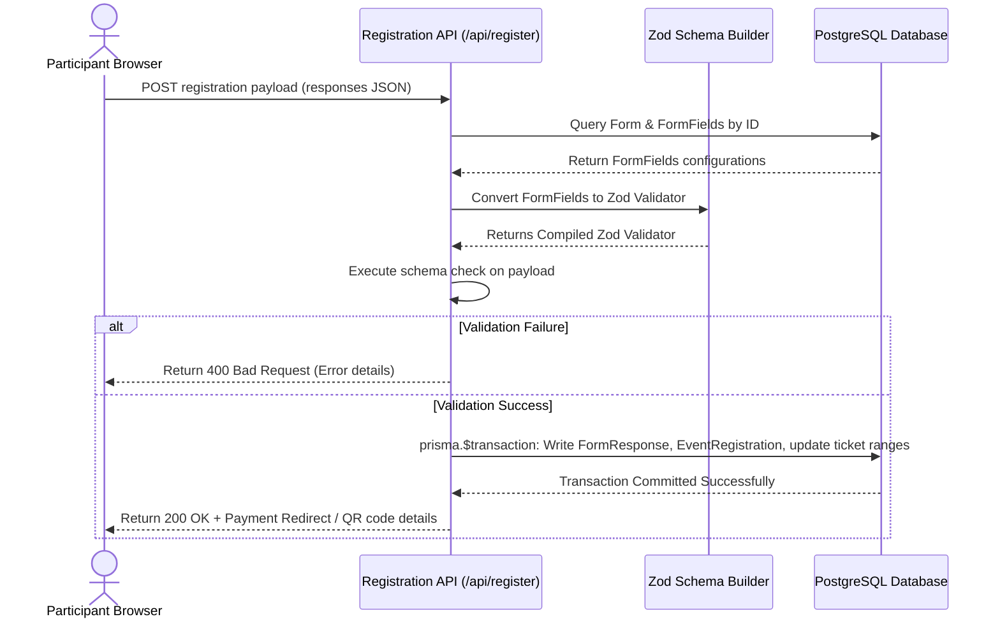
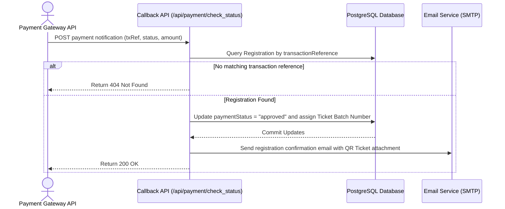
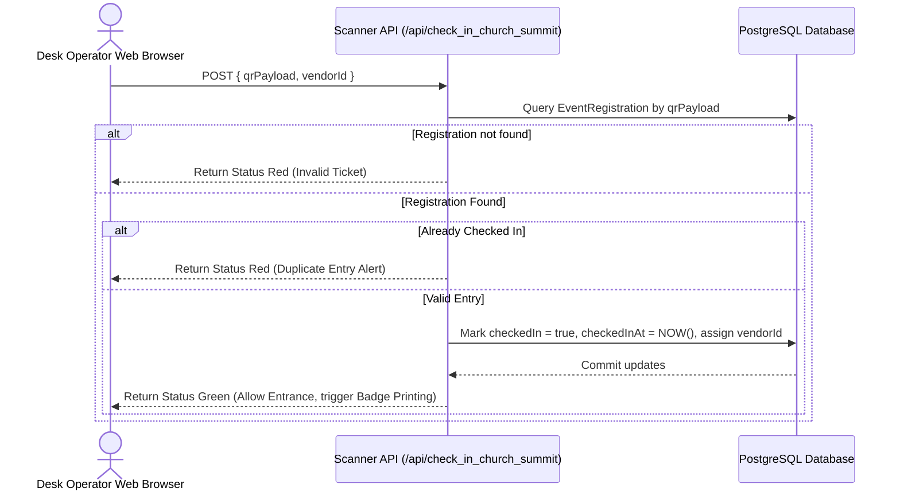

# SYSTEM DESIGN DOCUMENT (SDD)
## GCME Multi-Tenant Event Platform

---

## 1. Document Information

| Attribute | Details |
| :--- | :--- |
| **System** | cls-event |
| **Document Type** | High-Level System Architecture and Database Design (SDD) |
| **Associated Version** | 3.0 |
| **Date of Creation** | June 5, 2026 |

---

## 2. High-Level Technology Stack

The platform is designed as a monolithic Next.js application, executing both client-side user interface rendering and server-side business logic within the same system runtime.

```
+-------------------------------------------------------------------------------+
|                                 Presentation Layer                            |
|             React 19, Radix UI Primitives, Tailwind CSS 4, Lucide Icons       |
+-------------------------------------------------------------------------------+
                                      |
                                      v
+-------------------------------------------------------------------------------+
|                                Application Layer                              |
|           Next.js 16 (App Router), TanStack React Query, better-auth          |
+-------------------------------------------------------------------------------+
                                      |
                                      v
+-------------------------------------------------------------------------------+
|                                 Database Layer                                |
|                        Prisma Client ORM, PostgreSQL Database                 |
+-------------------------------------------------------------------------------+
```

### Stack Details
* **Frontend UI Layer:** React 19, Radix UI primitives (accessible styling elements), Tailwind CSS 4 (utility-first layouts), and Lucide React (vector icon representations).
* **Application Core:** Next.js 16 utilizing the App Router model. Server Actions and Route Handlers (`route.ts`) act as the backend API layer. Client-side state synchronization is managed via TanStack React Query.
* **Authentication Engine:** `better-auth` utilizing the Prisma Adapter. Custom plugins extend session metadata to support organization identities and permissions.
* **Database Layer:** PostgreSQL database accessed via Prisma Client ORM.
* **Media & Output Engine:** `sharp` for server-side photo transformations, `qrcode` for matrix barcode generation, and `jspdf` / `html2canvas` for browser-based PDF generation.

---

## 3. Database Schema Models

The system architecture utilizes the database tables detailed below (configured in [schema.prisma](file:///Users/dsethiopia/Documents/code/gcme-event.%203/prisma/schema.prisma)):

### 3.1 Platform Identity & Membership Models

#### `User`
Stores the master credentials for administrators, staff, and platform operators.
* `id` (String, Primary Key, CUID)
* `name` (String, Optional)
* `email` (String, Unique)
* `emailVerified` (Boolean)
* `isPlatformSuperAdmin` (Boolean) - Grants global capability across organizations.
* `roleId` (String, Optional) - Legacy fallback role pointer.

#### `Organization`
The root tenant model. All core event configurations and registrant databases belong to an Organization.
* `id` (String, Primary key)
* `name` (String)
* `slug` (String, Unique)
* `ownerId` (String, references `User.id`)
* `settings` (Json) - Custom options (e.g. locale options, default templates, theme variables).

#### `OrganizationMember`
Resolves user privileges inside a specific organization.
* `id` (String, Primary key)
* `organizationId` (String, references `Organization.id`)
* `userId` (String, references `User.id`)
* `role` (`OrgRole` Enum: `OWNER`, `ADMIN`, `STAFF`)
* `permissions` (String Array) - Granular capability strings (e.g., `check_in_participants`, `view_financials`).

---

### 3.2 Dynamic Forms & Custom Questionnaire Models

#### `Form`
Defines the parameters of a dynamic registration form for events.
* `id` (String, Primary Key)
* `organizationId` (String, references `Organization.id`)
* `eventId` (String, Optional, references `Event.id`)
* `name` (String)
* `isActive` (Boolean)
* `defaultLocale` (String)
* `supportedLocales` (String Array) - e.g., `["en", "am", "or", "ti"]`.
* `i18nMeta` (Json) - UI layouts and localized form headings.

#### `FormField`
Describes a specific question or input element on a Form.
* `id` (String, Primary Key)
* `formId` (String, references `Form.id`)
* `fieldKey` (String) - Database-safe key used to store inputs (e.g. `church_name`).
* `label` (String) - Default label text.
* `labelI18n` (Json) - Translated variations of the label.
* `type` (`FormFieldType` Enum) - Supports inputs: `TEXT`, `TEXTAREA`, `NUMBER`, `EMAIL`, `PHONE`, `SELECT`, `RADIO`, `CHECKBOX`, `MULTI_SELECT`, `DATE`, `DATETIME`, `FILE`, `HIDDEN`.
* `required` (Boolean) - Validation flag.
* `order` (Int) - Positional sorting index.
* `options` (Json) - Available answers for dropdowns or radio lists.
* `validation` (Json) - Constraints (e.g. regex patterns, character lengths).

#### `FormResponse`
Stores user inputs from form submissions.
* `id` (String, Primary Key)
* `formId` (String, references `Form.id`)
* `organizationId` (String, references `Organization.id`)
* `eventId` (String, Optional, references `Event.id`)
* `responses` (Json) - Submitter inputs represented as key-value pairs matching `fieldKey` definitions.

---

### 3.3 Core Event Domain Models

#### `Event`
Describes a target summit or leadership conference.
* `id` (String, Primary Key)
* `organizationId` (String, references `Organization.id`)
* `name` (String)
* `slug` (String) - Friendly URL parameter.
* `startsAt` / `endsAt` (DateTime)
* `registrationFormId` (String, Optional) - Reference to primary registration Form.

#### `EventRegistration`
Represents a primary registration submission, tracking payment status and check-in metrics.
* `id` (String, Primary Key)
* `organizationId` (String, references `Organization.id`)
* `eventId` (String, references `Event.id`)
* `primaryResponseId` (String, Unique, references `FormResponse.id`)
* `isGroup` (Boolean) - Flag for multiple attendee bookings.
* `paymentStatus` (String) - e.g., `pending`, `approved`, `failed`.
* `paymentType` (String) - e.g., `TELEBIRR`, `MANUAL`.
* `transactionReference` (String, Optional)
* `amount` (String)
* `ticketNumber` (Int, Optional)
* `checkedIn` (Boolean)
* `checkedInAt` (DateTime, Optional)
* `isBadgePrinted` (Boolean)
* `badgePrintedAt` (DateTime, Optional)
* `qrPayload` (String, Unique) - Encrypted payload for check-in.
* `vendorId` (String, Optional, references `Vendor.id`)
* `groupId` (String, Optional, references `Group.id`)

#### `EventAttendee`
Tracks individual members in group registrations.
* `id` (String, Primary Key)
* `eventRegistrationId` (String, references `EventRegistration.id`)
* `formResponseId` (String, Unique, references `FormResponse.id`)
* `ticketNumber` (Int)
* `checkedIn` (Boolean)
* `vendorId` (String, Optional)

---

## 4. Architectural Flows

### 4.1 Participant Dynamic Registration Flow



### 4.2 Webhook Payment Process Flow



### 4.3 On-Site QR Check-In Flow



---

## 5. Deployment Environments

```
                       +---------------------------+
                       |   Local Developer Machine |
                       |    SQLite/Postgres Local  |
                       +---------------------------+
                                     |
                                     v
                       +---------------------------+
                       |    GitHub CI Pipeline     |
                       | Linting & Docker Build Check|
                       +---------------------------+
                                     |
                                     v
+---------------------------------------------------------------------------------+
|                              Server Deployment                                  |
|                                                                                 |
|   +-----------------------+                         +-----------------------+   |
|   |     Staging Node      |                         |    Production Node    |   |
|   |  Docker Container     |                         |  Docker Container     |   |
|   |  App URL: stage.gcme  |                         |  App URL: summit.gcme |   |
|   +-----------------------+                         +-----------------------+   |
|               |                                                 |               |
|               v                                                 v               |
|   +-----------------------+                         +-----------------------+   |
|   |   PostgreSQL Instance |                         |   PostgreSQL Instance |   |
|   |   (Isolated DB)       |                         |   (Isolated DB)       |   |
|   +-----------------------+                         +-----------------------+   |
+---------------------------------------------------------------------------------+
```

### 5.1 Local Development
* **Database:** Isolated PostgreSQL container running locally or SQLite configuration.
* **Environment Configuration:** Local environment variables (`.env`).
* **Tooling:** Prisma Studio wrapper running locally via port 5555.

### 5.2 Staging Environment
* **Platform:** VPS/Cloud VM running containerized instances.
* **Database:** Staging PostgreSQL database.
* **CI/CD:** Automated builds triggered on merges to release branches.

### 5.3 Production Environment
* **Infrastructure:** High-performance Linux VPS executing multi-container Docker Compose definitions.
* **Database:** Dedicated PostgreSQL database with automated snapshot backups.
* **Caching & Limits:** Reverse proxy configured with rate limits for core registration APIs.
