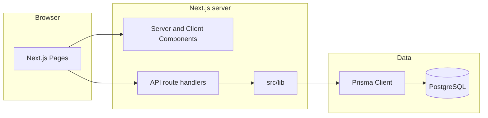

# cls-event — project documentation

This document describes the **cls-event** codebase: purpose, features, layout, how the frontend and server-side API fit together, authentication and roles, the data model, and how to configure and run the app.

---

## 1. Project purpose and audience

**cls-event** is a web application for **event registration and on-site operations** for a church leadership summit (branded as GCME in the staff dashboard). It supports:

- Public registration (individual and group) and payment flows
- Staff dashboard for registrations, financial overview, groups, vendors, badge printing, check-in, ticket batches/prefixes, and user management
- Summit-specific entry points (e.g. dedicated self-check-in and badge routes)

Public routes (no dashboard chrome) and authenticated dashboard routes under the `(dashboard)` route group coexist in the same Next.js app.

---

## 2. Technology stack

| Layer | Technology |
|--------|-------------|
| Framework | [Next.js](https://nextjs.org/) 16 (App Router), React 19, TypeScript |
| Styling | Tailwind CSS 4, [Radix UI](https://www.radix-ui.com/) primitives, `class-variance-authority`, `tailwind-merge` |
| Forms / validation | `react-hook-form`, `@hookform/resolvers`, Zod |
| Server state (client) | TanStack React Query |
| Authentication | [better-auth](https://www.better-auth.com/) with Prisma adapter — [src/lib/auth.ts](../src/lib/auth.ts), client [src/lib/auth-client.ts](../src/lib/auth-client.ts), HTTP handler [src/app/api/auth/[...all]/route.ts](../src/app/api/auth/[...all]/route.ts) |
| Database | PostgreSQL via [Prisma](https://www.prisma.io/) — [prisma/schema.prisma](../prisma/schema.prisma) |
| Email | Nodemailer — [src/lib/emailService.ts](../src/lib/emailService.ts) |
| Payments | External gateway (Telebirr-style URL/token) — see [`.env.example`](../.env.example) |
| Media / PDF / QR | `sharp`, `qrcode`, QR scanner, `jspdf`, `html2canvas`, `html-to-image`, etc. (see `package.json`) |

Sessions are enriched so each `user` includes `role` (name) and `permissions` (string array) via better-auth’s `customSession` plugin in [src/lib/auth.ts](../src/lib/auth.ts).

---

## 3. Repository structure

| Area | Path | Role |
|------|------|------|
| Pages & layouts | [src/app/](../src/app/) | App Router: routes, `(dashboard)` group, `layout.tsx`, API `route.ts` files |
| UI | [src/components/](../src/components/) | `DashboardLayout`, `AuthGate`, shared `components/ui/*` |
| Shared / server code | [src/lib/](../src/lib/) | Prisma, auth, email, tickets, groups, rate limiting, utilities |
| Database | [prisma/](../prisma/) | Schema, migrations, seeds |
| Scripts | [scripts/](../scripts/) | One-off maintenance (e.g. amount fixes, local email tests) |
| Container / CI | `Dockerfile`, `docker-compose.yml`, [`.github/workflows/`](../.github/workflows/) | Build and deploy |

There is **no separate backend repository**. Server behavior is implemented as **Next.js Route Handlers** (`route.ts`) under `src/app/api/` plus libraries in `src/lib/`.

### High-level request flow

---

## 4. Frontend: routes and features

### Staff dashboard (`(dashboard)`)

Layout: [src/app/(dashboard)/layout.tsx](../src/app/(dashboard)/layout.tsx).  
The shell (sidebar, session-aware nav) lives in [src/components/DashboardLayout.tsx](../src/components/DashboardLayout.tsx).

Sidebar items and **route → permission** mapping are defined as `NAV_ITEMS` and `PERMISSION_MAP` in that file. Users with role **`Super Admin`** see **all** nav items regardless of permissions.

| Path | Label | Permission required (`PERMISSION_MAP`) |
|------|--------|----------------------------------------|
| `/list` | Overview | `view_financials` |
| `/admin-register` | New Registration | `register_participants` |
| `/history` | All Registration | `view_registrations` |
| `/groups` | Groups | `manage_groups` |
| `/vendors` | Vendors | `manage_vendors` |
| `/badges` | Badges | `view_registrations` |
| `/attendance` | Check-In | `check_in_participants` |
| `/batches` | Batch and Prefix | `manage_batches` |
| `/users` | User Management | `manage_users` |

Individual pages often **re-check** permissions (e.g. `Super Admin` or `permissions.includes('…')`) — see [src/app/(dashboard)/vendors/page.tsx](../src/app/(dashboard)/vendors/page.tsx) as an example.

### Auth UX

- [src/components/AuthGate.tsx](../src/components/AuthGate.tsx): shared “login required” / “access denied” full-page states.
- Client session: `authClient.useSession()` from [src/lib/auth-client.ts](../src/lib/auth-client.ts).

### Public and semi-public pages

| Route | File | Purpose (summary) |
|-------|------|---------------------|
| `/` | [src/app/page.tsx](../src/app/page.tsx) | Landing / registration hub (uses `translations` for EN/AM/OR/TI) |
| `/register` | [src/app/register/page.tsx](../src/app/register/page.tsx) | Registration flow (same translation pattern) |
| `/attendance` | [src/app/attendance/page.tsx](../src/app/attendance/page.tsx) | Attendance-related UI |
| `/public-badges` | [src/app/public-badges/page.tsx](../src/app/public-badges/page.tsx) | Public badge display |
| `/self-checkin` | [src/app/self-checkin/page.tsx](../src/app/self-checkin/page.tsx) | Self-service check-in |
| `/auth/accept-invite` | [src/app/auth/accept-invite/page.tsx](../src/app/auth/accept-invite/page.tsx) | Accept staff invitation |
| `/vendors/[id]` | [src/app/vendors/[id]/page.tsx](../src/app/vendors/[id]/page.tsx) | Vendor-specific public page |
| `/tr_2025church_leadership_summit_self_checkin` | [src/app/tr_2025church_leadership_summit_self_checkin/page.tsx](../src/app/tr_2025church_leadership_summit_self_checkin/page.tsx) | Summit-specific self-check-in |
| `/tr_2025church_leadership_summit_badges` | [src/app/tr_2025church_leadership_summit_badges/page.tsx](../src/app/tr_2025church_leadership_summit_badges/page.tsx) | Summit-specific badges |

### Internationalization (limited)

[src/app/translations.ts](../src/app/translations.ts) defines `Language` (`en` | `am` | `or` | `ti`) and string tables. It is used on the home page and registration page, not as a global i18n framework.

---

## 5. Backend: API surface

All API routes are **Route Handlers** under [src/app/api/](../src/app/api/). There are **32** `route.ts` files. They are grouped below by concern.

### Authentication and invitations

- [src/app/api/auth/[...all]/route.ts](../src/app/api/auth/[...all]/route.ts) — better-auth catch-all (sign-in, sign-up, session, etc.)
- [src/app/api/auth/me/route.ts](../src/app/api/auth/me/route.ts) — current user
- [src/app/api/auth/validate-invite/route.ts](../src/app/api/auth/validate-invite/route.ts), [complete-invite/route.ts](../src/app/api/auth/complete-invite/route.ts) — invitation flow

### Registrations, summit, payments

- [src/app/api/register_church_summit/route.ts](../src/app/api/register_church_summit/route.ts), `[id]/`, `[id]/restore/` — create/update/restore registrations
- [src/app/api/check_in_church_summit/route.ts](../src/app/api/check_in_church_summit/route.ts) — check-in
- [src/app/api/payment/church_summit/route.ts](../src/app/api/payment/church_summit/route.ts), [payment/check_status/route.ts](../src/app/api/payment/check_status/route.ts) — payment create/status
- [src/app/api/update_payment/[paymentId]/route.ts](../src/app/api/update_payment/[paymentId]/route.ts) — payment updates

### Operations (groups, batches, vendors, badges, uploads)

- [src/app/api/groups/route.ts](../src/app/api/groups/route.ts), [assign/route.ts](../src/app/api/groups/assign/route.ts), [bulk-assign/route.ts](../src/app/api/groups/bulk-assign/route.ts), `[id]/route.ts`
- [src/app/api/batches/route.ts](../src/app/api/batches/route.ts), [batches/[id]/route.ts](../src/app/api/batches/[id]/route.ts)
- [src/app/api/vendors/route.ts](../src/app/api/vendors/route.ts), [vendors/[id]/route.ts](../src/app/api/vendors/[id]/route.ts), [vendors/stats/route.ts](../src/app/api/vendors/stats/route.ts), [vendors/usage-details/route.ts](../src/app/api/vendors/usage-details/route.ts)
- [src/app/api/badges/mark-printed/route.ts](../src/app/api/badges/mark-printed/route.ts)
- [src/app/api/upload/route.ts](../src/app/api/upload/route.ts), [uploads/[filename]/route.ts](../src/app/api/uploads/[filename]/route.ts)

### Self-check-in

- [src/app/api/self-checkin/search/route.ts](../src/app/api/self-checkin/search/route.ts)

### Admin

- [src/app/api/admin/users/route.ts](../src/app/api/admin/users/route.ts), [invitations/route.ts](../src/app/api/admin/invitations/route.ts), [roles/route.ts](../src/app/api/admin/roles/route.ts), [permissions/route.ts](../src/app/api/admin/permissions/route.ts)
- [src/app/api/admin/reassign_tickets/route.ts](../src/app/api/admin/reassign_tickets/route.ts), [backfill_tickets/route.ts](../src/app/api/admin/backfill_tickets/route.ts), [test-email/route.ts](../src/app/api/admin/test-email/route.ts)

### Authorization pattern

Protected handlers typically load the session user with role and permissions, then allow access if the user’s role is **`Super Admin`** **or** a required permission is present (e.g. `manage_vendors`, `manage_groups`, `manage_batches`). See [src/app/api/vendors/route.ts](../src/app/api/vendors/route.ts), [src/app/api/groups/route.ts](../src/app/api/groups/route.ts), and [src/app/api/batches/route.ts](../src/app/api/batches/route.ts).

---

## 6. Roles and permissions (RBAC)

### Data model

Defined in [prisma/schema.prisma](../prisma/schema.prisma):

- **User** — `roleId` → **Role**
- **Role** ↔ **Permission** (many-to-many)
- **Invitation** — email + `roleId` + token for onboarding staff

### Canonical permission names

Source of truth for seed data: `perms` in [prisma/seed.ts](../prisma/seed.ts) (must stay aligned with `PERMISSION_MAP` in [DashboardLayout.tsx](../src/components/DashboardLayout.tsx)).

| Permission | Description (from seed) |
|------------|-------------------------|
| `manage_users` | Invite and manage team members (User Management) |
| `manage_roles` | Create and assign roles |
| `view_registrations` | View participant list (All Registration, Badges) |
| `manage_payments` | Approve manual payments |
| `register_participants` | Internal registration form (New Registration) |
| `check_in_participants` | Check-in |
| `view_financials` | Revenue and financial reports (Overview) |
| `delete_registrations` | Delete registrations |
| `edit_registrations` | Edit registration details |
| `manage_batches` | Ticket batches and prefixes |
| `manage_groups` | Participant groups |
| `manage_vendors` | Vendors and catering |

### Default seeded roles

- **Super Admin** — all permissions above.
- **Admin** — same as Super Admin **except** `manage_roles` is **excluded** (cannot manage role definitions).

The seed script also creates default **batches** (ticket prefixes by role category) and **vendors**. See [prisma/seed.ts](../prisma/seed.ts).

### Bootstrap admin user

- [prisma/seed-auth.ts](../prisma/seed-auth.ts) creates an admin via better-auth’s API and assigns **Super Admin**; requires roles from `seed.ts` first.

---

## 7. Data model (concise)

### Registration & Attendee

- **Registration** — primary registration record: `fullName`, `churchName`, `serviceRole`, `phoneNumber`, `email`, `amount`, `paymentStatus`, `paymentType`, `transactionReference`, `receiptPath`, group flags, `checkedIn` / `checkedInAt`, `ticketNumber`, `vendorId`, `groupId`, optional `deletedAt` (soft delete), `isBadgePrinted` / `badgePrintedAt`, JSON `activities`, coupon/discount fields.
- **Attendee** — line items under a group registration, linked by `registrationId`; similar check-in and badge fields.

### Batch, Group, Vendor

- **Batch** — named batch with `prefix`, arrays for `roles`, `paymentStatuses`, `coupons`, `registrationIds`.
- **Group** — named group with filters/collections and optional `vendorId`.
- **Vendor** — `name`, `capacity`; linked from registrations, attendees, groups.

### Auth (better-auth + Prisma)

- **User**, **Session**, **Account**, **Verification** — standard better-auth tables.
- **Role**, **Permission** — custom RBAC as above.

---

## 8. Configuration and operations

### Environment variables

See [`.env.example`](../.env.example) for:

- App URLs: `NEXT_PUBLIC_*`, `INTERNAL_API_URL`
- `DATABASE_URL` (and `DOCKER_DATABASE_URL` for Docker network)
- `BETTER_AUTH_URL`, `BETTER_AUTH_SECRET`
- Admin seed: `ADMIN_EMAIL`, `ADMIN_PASSWORD`, `ADMIN_NAME`
- Event copy: `EVENT_*`, `FROM_NAME`
- SMTP: `SMTP_HOST`, `SMTP_PORT`, `SMTP_USER`, `SMTP_PASS`
- Payment: `PAYMENT_GATEWAY_URL`, `PAYMENT_GATEWAY_TOKEN_SUMMIT`

### Scripts

From `package.json`:

- `npm run dev` — Next.js dev server
- `npm run build` / `npm run start` — production (`start` binds `0.0.0.0:3000`)

Prisma:

- Migrations: `npx prisma migrate dev` (or deploy in CI)
- Seed: `npx tsx prisma/seed.ts` (defines roles, permissions, batches, vendors, initial admin user logic)
- Optional: `npx tsx prisma/seed-auth.ts` after seed when using the standalone auth seed script

### Docker / build

[next.config.ts](../next.config.ts) sets `output: 'standalone'` for a self-contained Node output suitable for Docker. **Note:** `typescript.ignoreBuildErrors` is enabled — fixing type errors is recommended for long-term maintainability.

---

## 9. Appendix

### `jsonDb` module

[src/lib/jsonDb.ts](../src/lib/jsonDb.ts) implements file-based JSON storage for a registration-shaped model. **It is not imported anywhere else in this repository**; the live app uses **Prisma/PostgreSQL**. Treat `jsonDb` as legacy or experimental unless you wire it in explicitly.

### Related files

- Email templates and sending: [src/lib/emailService.ts](../src/lib/emailService.ts)
- Ticket helpers: [src/lib/tickets.ts](../src/lib/tickets.ts)
- Phone utilities: [src/lib/phone.ts](../src/lib/phone.ts)
- Rate limiting: [src/lib/rate-limit.ts](../src/lib/rate-limit.ts)

---

*Last updated to match the repository layout and seeds as of the documentation commit.*
